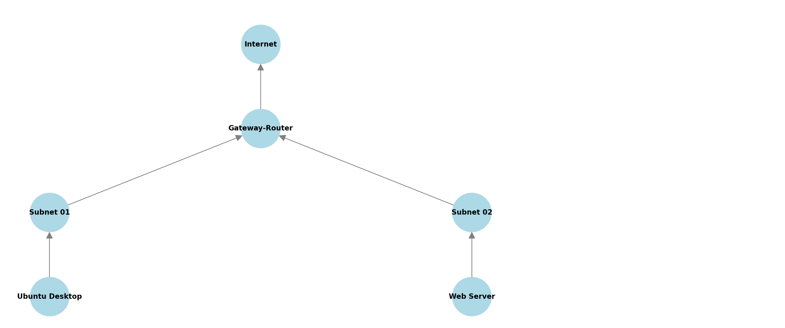

# Portfolio 02: Building a Virtual Sandboxed Network

This repository documents the process, configurations, and outcomes of the **Portfolio 02: Building a Virtual Sandboxed Network** project. Below, you will find a detailed explanation of each stage, along with challenges encountered and solutions implemented.

---

## 1. Overview of the Network Design
This project involves creating a sandboxed virtual network with three key components:

- **Ubuntu Desktop (Subnet 01)**: Used as a management interface to configure other network components.
- **Gateway Router**: Serves as the primary router for the network, connecting Subnet 01, Subnet 02, and the internet.
- **Web Server (Subnet 02)**: Hosts applications and services for testing network functionality.

The primary objective is to simulate a real-world network environment using **VirtualBox**, IP subnetting, and open-source software. The sandboxed network ensures a safe space to experiment with networking concepts and tools.

---

## 2. Network Diagram



The network diagram illustrates the topology:
- **Internet** connects to the **Gateway Router**.
- **Subnet 01** connects to the **Ubuntu Desktop**.
- **Subnet 02** connects to the **Web Server**.

### Challenges:
- **Tool Selection**: Deciding between GNS3 and Packet Tracer for creating a clear, professional-looking diagram.
- **Subnet Design**: Determining IP ranges and ensuring they don't overlap or conflict.

---

## 3. IP Address Table

| Device               | Role                   | IP Address        | Subnet Mask      |
|----------------------|------------------------|-------------------|------------------|
| Ubuntu Desktop       | Management Interface   | 192.168.25.10     | 255.255.255.0    |
| Gateway Router (LAN) | Subnet 01 Interface    | 192.168.25.1      | 255.255.255.0    |
| Gateway Router (LAN) | Subnet 02 Interface    | 192.168.125.1     | 255.255.255.0    |
| Gateway Router (NAT) | Internet Interface     | Dynamic (NAT)     | N/A              |
| Web Server           | Application Server     | 192.168.125.10    | 255.255.255.0    |

### Challenges:

1. Assigning IP addresses and configuring the network interfaces with netplan was straightforward, and I was able to successfully ping the Gateway Router from both subnets without any issues.
2. However, I encountered difficulties when attempting to send pings to external networks beyond the Gateway Router. The packets were not being routed correctly.
3. After extensive research and troubleshooting, I discovered that I needed to configure proper routing on the Gateway Router using iptables. Setting up NAT and enabling packet forwarding resolved the issue, allowing devices on both subnets to access external networks successfully.
---

## 4. Configuration Steps

### 4.1. Gateway Router Setup
1. Created a virtual machine for the **Gateway Router** and installed Ubuntu Server.
2. Configured **three network adapters** in VirtualBox:
   - Adapter 1: **NAT** for internet access.
   - Adapter 2: **Internal Network** for Subnet 01.
   - Adapter 3: **Internal Network** for Subnet 02.
3. Installed and configured `iptables` for routing:
   ```bash
   sudo sysctl -w net.ipv4.ip_forward=1
   sudo iptables -A FORWARD -i enp0s3 -o enp0s8 -j ACCEPT
   sudo iptables -A FORWARD -i enp0s8 -o enp0s3 -j ACCEPT
   sudo iptables -A POSTROUTING -t nat -j MASQUERADE

   
